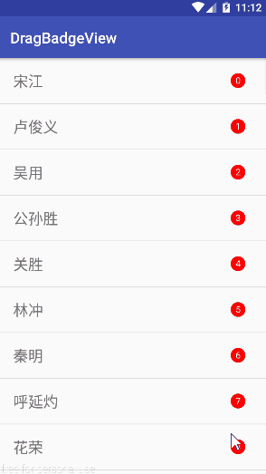
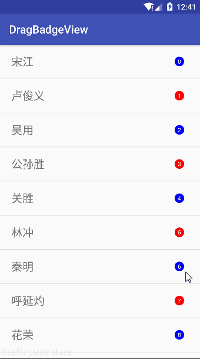

## DragBadgeView
仿QQ可拖拽控件  

博客地址:[http://blog.csdn.net/fendoudebb/article/details/76146252](http://blog.csdn.net/fendoudebb/article/details/76146252)
## 样例演示


## 引入
### 添加依赖
```
dependencies {
	compile 'com.fendoudebb.view:dragbadgeview:1.0.2'
}
``` 
### xml配置
```
<com.fendoudebb.view.DragBadgeView
        android:id="@+id/drag_view"
        android:layout_width="wrap_content"
        android:layout_height="wrap_content"
        android:paddingBottom="2dp"
        android:paddingLeft="5dp"
        android:paddingRight="5dp"
        android:paddingTop="2dp"
        app:dragEnable="false"/>
```
## 回调
```java
mDragBadgeView.setOnDragBadgeViewListener(new DragBadgeView.OnDragBadgeViewListener() {
    @Override
    public void onDisappear(String text) {
        Toast.makeText(getApplicationContext(), text + "条信息隐藏!", Toast.LENGTH_SHORT).show();
    }
});
```
## 设置文字
```java
app:text="测试"
```
```java
mDragBadgeView.setText("测试");
```
## 设置字体大小
```java
app:textSize="12sp"
```
```java
mDragBadgeView.setTextSize(dp2sp(15));
```
## 设置控件颜色
```java
app:bgColor="#f0f"
```
```java
mDragBadgeView.setBgColor(Color.BLUE);
```
## 设置能否拖拽
```java
app:dragEnable="false"
```
```java
mDragBadgeView.setDragEnable(true);
```
